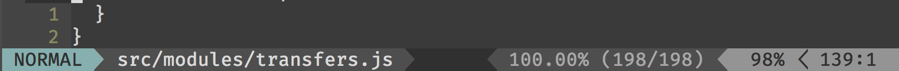

# vim-flow-plus

## Requirements

Vim version that supports `json_decode`.

## Install

If you use [vim-plug](https://github.com/junegunn/vim-plug):

```
Plug 'carlosrocha/vim-flow-plus'
```

## Using

### Display coverage

Using [lightline](https://github.com/itchyny/lightline.vim):

```VimL
let g:lightline = {
    "...
      \   'right': [ [ 'percent', 'lineinfo' ],
      \              [ 'syntastic', 'flow' ],
      \              [ 'fileformat', 'fileencoding', 'filetype' ] ],
      \ },
      \ 'component_function': {
      " ...
      \   'flow': 'LightlineFlowCoverage',
      " ...
      \ },
      \ }

function! LightlineFlowCoverage()
  if exists('b:flow_coverage_status')
    return b:flow_coverage_status
  endif
  return ''
endfunction
```

Result:


## Commands

### `FlowCoverageToggle`
Toggle to highlight uncovered expressions in the current file.

### `FlowPrevRef`
Go to the next reference of the variable under the cursor.

### `FlowNextRef`
Go to the previous reference of the variable under the cursor.

### `FlowTypeAtPos`
Displays the type of the variable under the cursor.

### `FlowGetDef`

Go to the definition of the variable under the cursor.
